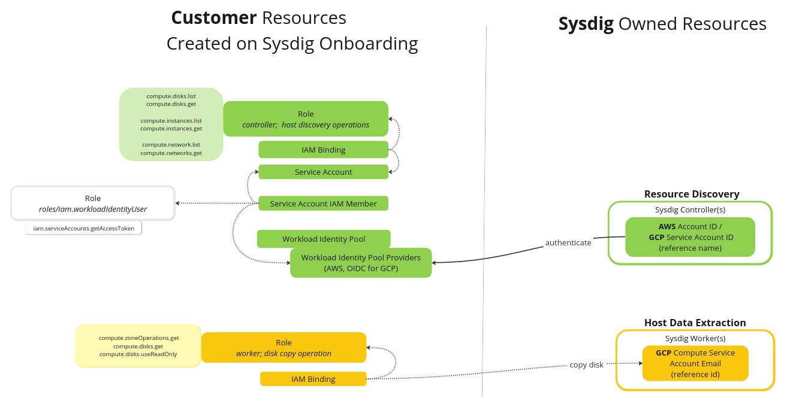

# GCP Agentless Scanning Module

This module will deploy required authentication system required for Sysdig to be able to scan hosts on your Google 
Cloud Account.

The following resources will be created in each instrumented project:
- For the **Resource Discovery**: Enable Sysdig to authenticate through a Workload Identity Pool (requires provider, 
  service account, role, and related bindings)  in order to be able to discover the VPC/Instance/Volumes
- For the **Host Data Extraction**: Enable Sysdig to create a disk copy on our SaaS platform, to be able to extract 
  the data required for security assessment.

If instrumenting a GCP Organization, ... TODO

## Usage

For usage instructions refer to Sysdig official documentation.

<!-- BEGINNING OF PRE-COMMIT-TERRAFORM DOCS HOOK -->
<!-- END OF PRE-COMMIT-TERRAFORM DOCS HOOK -->

## Authors

Module is maintained by [Sysdig](https://sysdig.com).

## License

Apache 2 Licensed. See LICENSE for full details.

