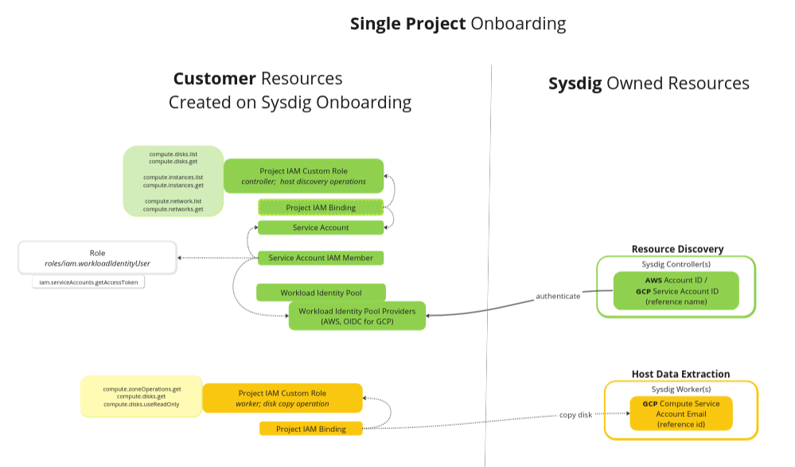
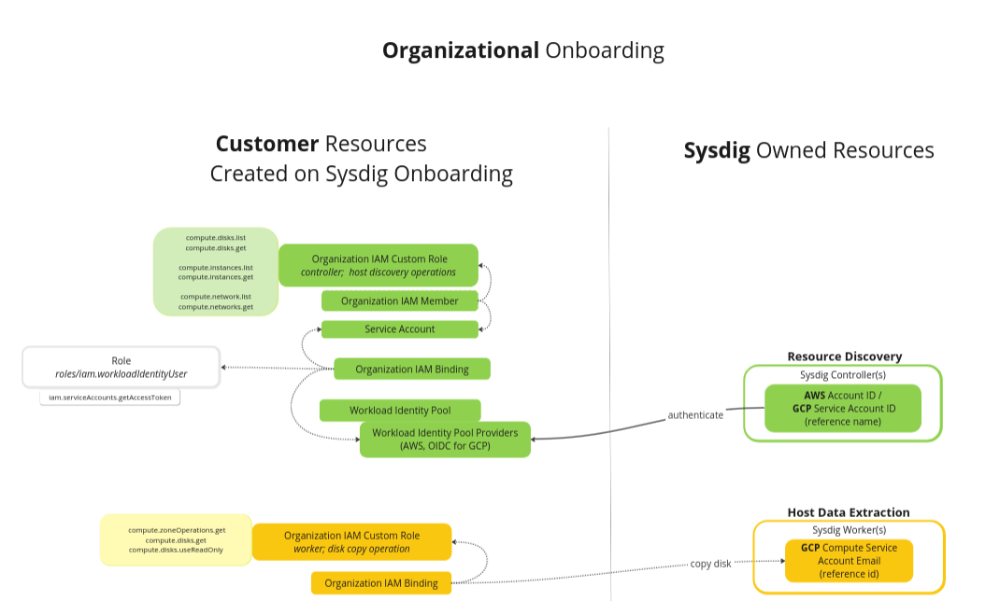

# GCP Agentless Scanning Module

This module will deploy required resources for Sysdig to be able to scan hosts on your Google Cloud Account.

The following resources will be created on each instrumented project:
- For the **Resource Discovery**: Enable Sysdig to authenticate through a Workload Identity Pool (requires provider, 
  service account, role, and related bindings)  in order to be able to discover the VPC/Instance/Volumes
- For the **Host Data Extraction**: Enable Sysdig to create a disk copy on our SaaS platform, to be able to extract 
  the data required for security assessment.

## Single Project Setup

## Organizational Setup

  

## Usage

For usage instructions refer to Sysdig official documentation.
While on Controlled Availability check with your Sysdig representative.
  

<!-- BEGIN_TF_DOCS -->
## Requirements

| Name | Version |
|------|---------|
|  [terraform](#requirement\_terraform) | >=1.0 |
|  [google](#requirement\_google) | >= 4.1, < 5.0 |
|  [random](#requirement\_random) | >= 3.1, < 4.0 |

## Providers

| Name | Version |
|------|---------|
|  [google](#provider\_google) | >= 4.1, < 5.0 |
|  [random](#provider\_random) | >= 3.1, < 4.0 |

## Modules

No modules.

## Resources

| Name | Type |
|------|------|
| [google_iam_workload_identity_pool.agentless](https://registry.terraform.io/providers/hashicorp/google/latest/docs/resources/iam_workload_identity_pool) | resource |
| [google_iam_workload_identity_pool_provider.agentless](https://registry.terraform.io/providers/hashicorp/google/latest/docs/resources/iam_workload_identity_pool_provider) | resource |
| [google_iam_workload_identity_pool_provider.agentless_gcp](https://registry.terraform.io/providers/hashicorp/google/latest/docs/resources/iam_workload_identity_pool_provider) | resource |
| [google_project_iam_binding.admin-account-iam](https://registry.terraform.io/providers/hashicorp/google/latest/docs/resources/project_iam_binding) | resource |
| [google_project_iam_binding.controller_custom](https://registry.terraform.io/providers/hashicorp/google/latest/docs/resources/project_iam_binding) | resource |
| [google_project_iam_custom_role.controller](https://registry.terraform.io/providers/hashicorp/google/latest/docs/resources/project_iam_custom_role) | resource |
| [google_project_iam_custom_role.worker_role](https://registry.terraform.io/providers/hashicorp/google/latest/docs/resources/project_iam_custom_role) | resource |
| [google_service_account.controller](https://registry.terraform.io/providers/hashicorp/google/latest/docs/resources/service_account) | resource |
| [google_service_account_iam_member.controller_custom](https://registry.terraform.io/providers/hashicorp/google/latest/docs/resources/service_account_iam_member) | resource |
| [google_service_account_iam_member.controller_custom_gcp](https://registry.terraform.io/providers/hashicorp/google/latest/docs/resources/service_account_iam_member) | resource |
| [random_id.suffix](https://registry.terraform.io/providers/hashicorp/random/latest/docs/resources/id) | resource |
| [google_project.project](https://registry.terraform.io/providers/hashicorp/google/latest/docs/data-sources/project) | data source |

## Inputs

| Name | Description | Type | Default | Required |
|------|-------------|------|---------|:--------:|
|  [project\_id](#input\_project\_id) | GCP Project ID | `string` | n/a | yes |
|  [worker\_identity](#input\_worker\_identity) | Sysdig provided Identity for the Service Account in charge of performing the host disk analysis | `string` | n/a | yes |
|  [role\_name](#input\_role\_name) | Name for the Worker Role on the Customer infrastructure | `string` | `"SysdigAgentlessHostRole"` | no |
|  [suffix](#input\_suffix) | By default a random value will be autogenerated. Suffix word to enable multiple deployments with different naming (Workload Identity Pool and Providers have a soft deletion on Google Platform that will disallow name re-utilization) | `string` | `null` | no |
|  [sysdig\_account\_id](#input\_sysdig\_account\_id) | Sysdig provided GCP Account designated for the host scan. One of `sysdig_backend` or `sysdig_account_id`must be provided | `string` | `null` | no |
|  [sysdig\_backend](#input\_sysdig\_backend) | Sysdig provided AWS Account designated for the host scan. One of `sysdig_backend` or `sysdig_account_id`must be provided | `string` | `null` | no |

## Outputs

| Name | Description |
|------|-------------|
|  [controller\_service\_account](#output\_controller\_service\_account) | n/a |
|  [json\_payload](#output\_json\_payload) | n/a |
|  [project\_id](#output\_project\_id) | n/a |
|  [project\_number](#output\_project\_number) | n/a |
|  [workload\_identity\_pool\_provider](#output\_workload\_identity\_pool\_provider) | n/a |
<!-- END_TF_DOCS -->

## Authors

Module is maintained by [Sysdig](https://sysdig.com).

## License

Apache 2 Licensed. See LICENSE for full details.